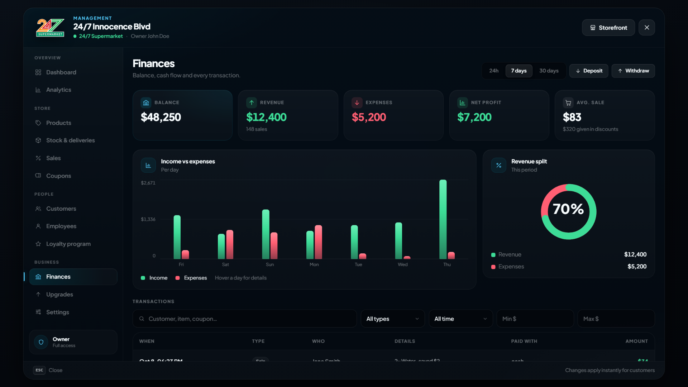
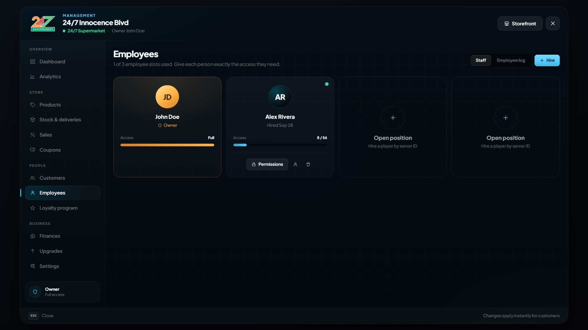

# Ownership & management

Ownership, deliveries, limits and upgrades are set in `config/management.lua`. Owners and staff open the management menu from the **Manage** button in the shop.

<figure><figcaption><p>The management menu: Finances</p></figcaption></figure>

## Ownership

```lua
Config.Ownership = {
    enabled = true,            -- false: no player ownership, every shop runs from the config
    maxPerPlayer = 2,          -- shops one character may own
    sellBackRate = 0.6,        -- share of the buy-in price paid back when selling to the city
    purchaseAccount = 'bank',  -- account the buy-in price is taken from
    baseCapacity = 500,        -- stock units before upgrades
    baseProductSlots = 12,     -- products before upgrades
    baseEmployeeSlots = 3,     -- employees before upgrades
}
```

* **Buying:** a store with `ownable = true` and a `price` shows a **Buy shop** button. The price is taken from `purchaseAccount`. The new owner starts with the first `baseProductSlots` products of the catalog, with no stock.
* **Selling to the city:** pays `price × sellBackRate` (the original buy-in price) plus the shop balance into the owner's bank, and resets the store.
* **Selling to a player:** the owner enters the buyer's server ID and a price (0 is allowed). The buyer gets a prompt for 60 seconds and pays from their bank; the seller is paid into theirs. Employees and stock stay with the shop. The buyer can't go over `maxPerPlayer`.


Selling to the city removes the shop's products, stock, employees, sales, coupons and customer data (history, loyalty points, bans). Pending deliveries are cancelled **without a refund**.


Owned shops sell only what is in stock. Owners fill the shelves by ordering from the supplier or moving items from their own inventory.

## Deliveries

```lua
Config.Deliveries = {
    baseMinutes = 20,  -- minutes before an order arrives (before Express Logistics)
    maxLines = 20,     -- different products in one order
    paymentAccounts = { shop = true, cash = true, bank = true },
}
```

* Orders are paid at the wholesale price, minus the Reputation discount. `shop` pays from the shop balance and needs the **Pay orders with shop funds** permission; `cash` and `bank` use the ordering player's own money.
* Pending orders count towards the stock capacity, so an order that would overfill the shop is refused.
* Delivery timers are stored in the database, so they keep running through restarts. Online staff get a notification when an order arrives.
* A pending order can be cancelled for a full refund to whoever paid.

## Limits

```lua
Config.Finance = { maxTransfer = 10000000 }

Config.Limits = {
    nameLength = 32,
    codeLength = 16,
    maxPrice = 1000000,
    maxSalePercent = 90,
    maxCouponPercent = 90,
    maxSales = 15,
    maxCoupons = 40,
}
```

| Option | What it limits |
| --- | --- |
| `Config.Finance.maxTransfer` | One deposit or withdrawal from the shop balance. |
| `nameLength` | Characters in a shop name. |
| `codeLength` | Characters in a coupon code. |
| `maxPrice` | A product price, and the money values of coupons and rewards. |
| `maxSalePercent` | The discount of a sale, in %. |
| `maxCouponPercent` | The discount of a percentage coupon or reward, in %. |
| `maxSales` | Active sales in one shop. |
| `maxCoupons` | Coupons in one shop. |

## Upgrades

Owners buy upgrades with the shop balance. Each level's `value` is what the shop gets at that level:

| Upgrade | `value` means |
| --- | --- |
| `capacity` | Total stock units |
| `reputation` | % discount on wholesale orders |
| `logistics` | % faster deliveries |
| `productSlots` | Number of products |
| `employeeSlots` | Number of employees |
| `loyalty` | Unlocks the loyalty program (one level) |

```lua
capacity = {
    label = 'Stock Capacity',
    description = 'Store more units across all products.',
    icon = 'box',
    levels = {
        { price = 25000, value = 1000 },
        { price = 60000, value = 2000 },
        { price = 120000, value = 4000 },
    },
},
```

Add or remove levels freely; the UI follows the config.

## Shop settings

Under **Settings** owners can rename the store (unless the location has `lockName = true`), pick the map blip and set opening hours. Outside the opening hours customers can still open the shop, but they can't buy or sell. The in-game hour is used.

The icons and colours owners can pick for the blip:

```lua
Config.BlipChoices = {
    sprites = { 52, 59, 93, 110, 402, 431, 500, 605, 616 },
    colors = { 0, 1, 2, 3, 5, 25, 27, 38, 47, 83 },
}
```

## Employees and permissions

<figure><figcaption><p>Employees and their permissions</p></figcaption></figure>

Owners hire players by server ID (the player must be online) and choose exactly what each employee may do. There are 56 permissions in 12 groups:

| Group | Examples |
| --- | --- |
| Overview | View dashboard, see revenue metrics |
| Products | Add / remove products, change prices and categories, restrict products to jobs / gangs / players |
| Stock | Order stock, pay with shop funds, cancel deliveries, move items between inventory and stock |
| Sales | Create, end and restrict sales |
| Coupons | Create, delete and restrict coupons |
| Customers | View history, ban / unban, adjust loyalty points |
| Employees | Hire, fire, edit permissions, view the employee log |
| Finances | View balance, deposit, withdraw, view transactions and charts |
| Loyalty | Turn the program on/off, change the points rate, edit tiers and rewards |
| Upgrades | View and buy upgrades |
| Analytics | Product, sale, coupon and customer insights |
| Settings | Rename the shop, change blip and opening hours |

* The owner always has every permission.
* New hires start with view access to the dashboard, products and stock.
* Employees can only grant permissions they hold themselves, can't take away permissions they don't hold, and can't change their own.
* Parts of the menu an employee can't use are hidden.

Every permission is checked again on the server for each action.
