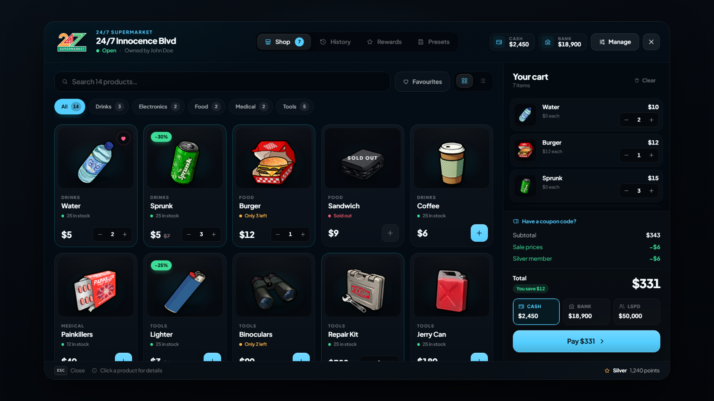

# DG Shops

A complete shop system for FiveM. Players get a modern storefront and can **buy the store itself**: set the prices, order stock, hire staff and grow it into a business. Everything runs on the server, and everything is configurable and translatable.

<figure><figcaption>
The storefront
</figcaption></figure>

## Features

**Customers**

* Storefront with search, categories, favourites, grid / list view and a product preview
* Cart paid with cash, bank, society or dirty money
* Coupon codes, loyalty points, tiers with permanent discounts and redeemable rewards
* Saved carts (presets) with share codes, purchase history with one-click reorder
* Licence-locked items, item-for-item trades, job-locked shops and opening hours
* Pawn shops where players sell what they carry
* Live stock updates while browsing

**Owners & staff**

* Buy a shop, sell it back to the city or sell it to another player
* 56 employee permissions: staff only see what they are allowed to use
* Products, prices, categories and who can buy what (jobs, gangs, players)
* Stock orders with delivery timers that survive restarts, and inventory ↔ shelf transfers
* Flash sales, coupons, customer bans and a loyalty-program editor
* Finances with charts and a searchable transaction log
* Upgrades: stock capacity, supplier discount, faster deliveries, more product and employee slots
* Analytics: best sellers, sale and coupon performance, top customers

## Editions

| Edition | What you get |
| --- | --- |
| **Escrow** | The resource through the Cfx portal. `config/*.lua` and `locales/*.json` are open; the rest of the Lua is encrypted. |
| **Open source** | The full source, including the UI source (`web/src`) and its build tooling. |

Both editions behave the same in game.

## Compatibility

DG Shops talks to your framework through [dg-bridge](https://github.com/GrekenDev/dg-bridge) (free):

* **Frameworks:** QBox, QBCore, ESX, ND_Core
* **Inventories:** ox_inventory, qb-inventory, ps-inventory, ESX
* **Interaction:** ox_target, qb-target, qtarget, i_interaction or walk-up text UI
* **Society banking:** Renewed-Banking, qb-management, esx_society, fd_banking, wasabi_banking, crm-banking, dg-banking (coming soon)

Switching framework or inventory is a dg-bridge setting; nothing in DG Shops changes.

## Get started

<table data-view="cards"><thead><tr><th></th><th></th><th></th><th data-hidden data-card-target data-type="content-ref"></th></tr></thead><tbody><tr><td><h4><i class="fa-download">:download:</i></h4></td><td><h4>Installation</h4></td><td>Requirements, start order and the database.</td><td><a href="installation.md">installation.md</a></td></tr><tr><td><h4><i class="fa-sliders">:sliders:</i></h4></td><td><h4>Main settings</h4></td><td>Look, payments, loyalty and customer features.</td><td><a href="configuration.md">configuration.md</a></td></tr><tr><td><h4><i class="fa-store">:store:</i></h4></td><td><h4>Shop types &#x26; locations</h4></td><td>Catalogs, stores, logos and pawn shops.</td><td><a href="shops.md">shops.md</a></td></tr></tbody></table>
